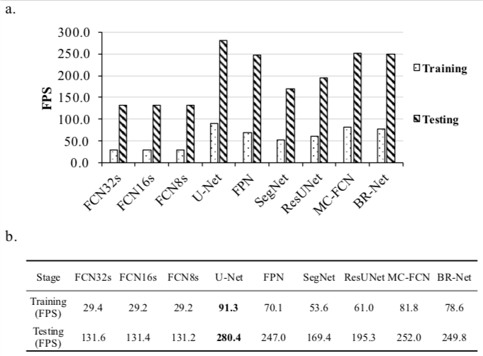

# Geoseg - A Computer Vision Package for Automatic Building Segmentation and Outline extraction

## Table of Contents
- <a href='#organization'>Organization</a>
- <a href='#usage'>Usage</a>
- <a href='#performance'>Performance</a>
- <a href='#visualization'>Visualization</a>
- <a href='#todo'>TODO</a>
- <a href='#citation'>Citation</a>


### Organization
- Subdirectories
```
Geoseg
  ├── dataset/
  │   └── train, validate and test dataset
  ├── checkpoint/
  │   └── pre-trained models
  ├── logs/
  │   ├── learning curve, statistic, etc.
  ├── models/
  │   ├── fcn, fpn, u-net, segnet, etc.
  ├── result/
  │   └── quantitative & qualitative result
  ├── utils/
  │   ├── datasets.py
  │   ├── metrics.py
  │   ├── preprocess.py
  │   ├── runner.py
  │   └── vision.py
```
- Files for training specific models
```
  ├── FCNs.py
  ├── FPN.py
  ├── UNet.py
  ├── MC-FCN.py
  ├── BR-Net.py
  ├── ResUNet.py
...
```
- Files for evaluation and visualization
```
├── visSingle.py
├── visSingleComparison.py
...
```
### Usage

- Download repo.
> git clone  https://github.com/huster-wgm/geoseg.git

- Download dataset
> Training dataset [Google Drive](https://drive.google.com/file/d/1boGcJz9TyK9XB4GUhjCHVu8XGtbgjjbi/view?usp=sharing) or
> [Baidu Yun](https://pan.baidu.com/s/1ujpzi8CgH_H5KSzhR1_bZA).
Details about the dataset can be found at <a href='#citation'>Citation</a>.

- Download pre-trainded models [Google Drive](https://drive.google.com/drive/folders/1ARbfh-um2c83r1nMegvS7IoCuRKovNuv?usp=sharing) or [Baidu Yun](https://pan.baidu.com/s/1ORYdDLDi5HzO1lU_1zsQUQ) code: uwxk
> 1. FCN8s_iter_5000.pth
> 2. FCN16s_iter_5000.pth
> 3. FCN32s_iter_5000.pth
> 4. SegNet_iter_5000.pth
> 5. UNet_iter_5000.pth
> 6. FPN_iter_5000.pth
> 7. ResUNet_iter_5000.pth
> 8. MC-FCN_iter_5000.pth
> 9. BR-Net_iter_5000.pth
> * Upcoming ...

- Step-by-step tutorial
> Jupyter-notebook [LINK](./How-to.ipynb)

### Performance

- Performance


- Computational efficiency



### Visualization

- Learning Curve (FCN8s)


- Segmentation and outline extraction (FCN8s)


### TODO
- Upgrade to pytorch 0.4.0
- Add support for more dataset

### Citation
The location, scale and resolution of the dataset please refer to paper.[LINK](https://www.mdpi.com/2072-4292/10/8/1195/htm)
```
@article{wu2018boundary,
  title={A boundary regulated network for accurate roof segmentation and outline extraction},
  author={Wu, Guangming and Guo, Zhiling and Shi, Xiaodan and Chen, Qi and Xu, Yongwei and Shibasaki, Ryosuke and Shao, Xiaowei},
  journal={Remote Sensing},
  volume={10},
  number={8},
  pages={1195},
  year={2018},
  publisher={Multidisciplinary Digital Publishing Institute}
}
```
If you use the code for your research, please cite the paper.[LINK](https://arxiv.org/pdf/1809.03175.pdf)
```
@article{wu2018geoseg,
  title={Geoseg: A Computer Vision Package for Automatic Building Segmentation and Outline Extraction},
  author={Wu, Guangming and Guo, Zhiling},
  journal={arXiv preprint arXiv:1809.03175},
  year={2018}
}
```
