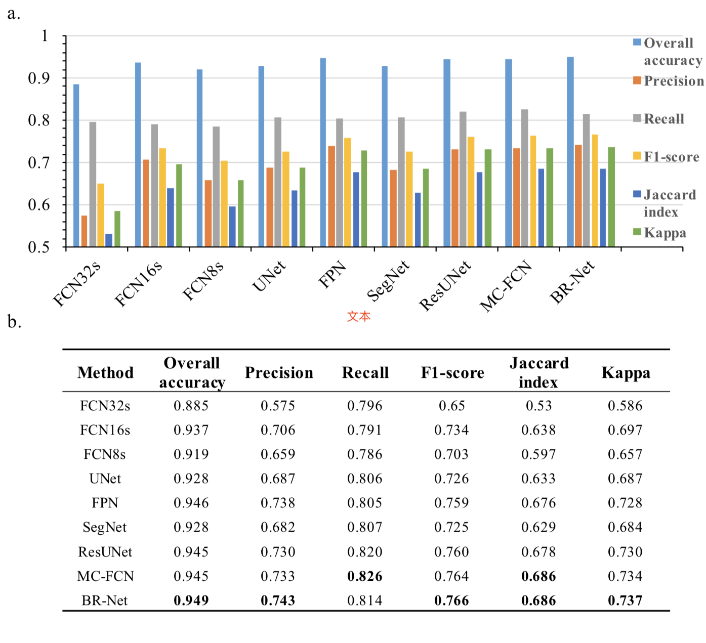
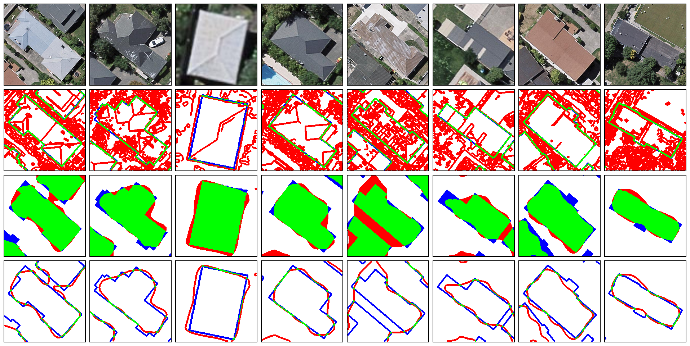
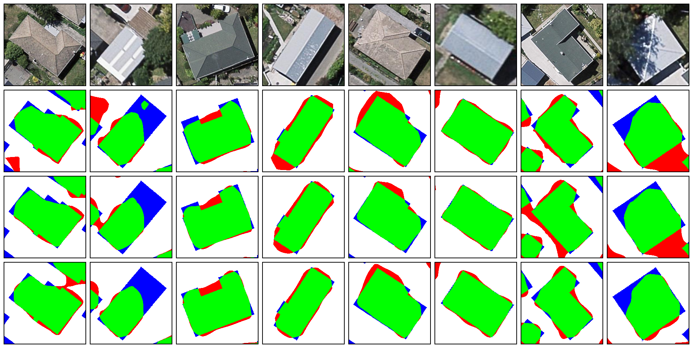
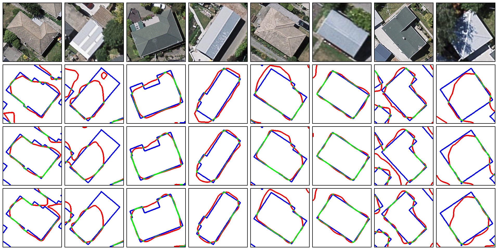

# Geoseg - A Computer Vision Package for Automatic Building Segmentation and Outline extraction

## Structure of directories
### sub directories
```
Geoseg:
  ├── dataset/
  │   └── train, validate and test dataset
  ├── logs/
  │   ├── learning curve, logging, statistic, etc.
  ├── models/
  │   ├── fcn, fpn, u-net, segnet, etc.
  ├── result/
  │   └── quantitative & qualitative result
  ├── utils/
  │   ├── datasets.py
  │   ├── metrics.py
  │   ├── preprocess.py
  │   ├── runner.py
  │   └── vision.py
  │  
  ├── FCNs.py
  ├── FPN.py
  ├── UNet.py
  ├── MC-FCN.py
  ├── BR-Net.py
  ├── ResUNet.py
...
```
### Files for generate visualization
```
├── visSingle.py
├── visSingleComparison.py
...
```

## Model Performance

### Performance
* Overall accuracy, precision, recall, f1-score, jaccard index(IoU) and kappa coefficient


### Computational efficiency
* Train and Test FPS


## Visualization Samples

### Learning Curve
* FCN8s


### Segmentation and outline extraction
* FCN8s


### Segmentation result comparison
* FCN32s, FCN16s, FCN8s


### Edge extraction result comparison
* FCN32s, FCN16s, FCN8s


# Training dataset
We provide an training dataset below:
https://drive.google.com/file/d/1boGcJz9TyK9XB4GUhjCHVu8XGtbgjjbi/view?usp=sharing

The location, scale and resolution of the dataset please refer to paper:
```
@article{wu2018boundary,
  title={A boundary regulated network for accurate roof segmentation and outline extraction},
  author={Wu, Guangming and Guo, Zhiling and Shi, Xiaodan and Chen, Qi and Xu, Yongwei and Shibasaki, Ryosuke and Shao, Xiaowei},
  journal={Remote Sensing},
  volume={10},
  number={8},
  pages={1195},
  year={2018},
  publisher={Multidisciplinary Digital Publishing Institute}
}
```
# Citation
If it helps, please cite the paper.
```
@article{wu2018geoseg,
  title={Geoseg: A Computer Vision Package for Automatic Building Segmentation and Outline Extraction},
  author={Wu, Guangming and Guo, Zhiling},
  journal={arXiv preprint arXiv:1809.03175},
  year={2018}
}
```
