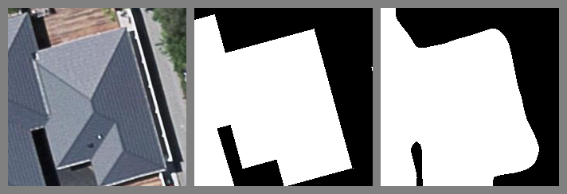
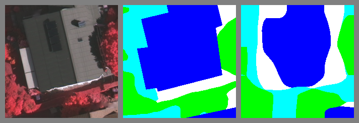
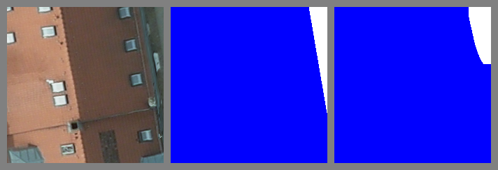

# Geoseg - A Computer Vision Package for Automatic Building Segmentation and Outline extraction

## Table of Contents
- <a href='#requirements'>Requirements</a>
- <a href='#organization'>Organization</a>
- <a href='#models'>Models</a>
- <a href='#usage'>Usage</a>
- <a href='#performance'>Performance</a>
- <a href='#visualization'>Visualization</a>
- <a href='#todo'>TODO</a>
- <a href='#citation'>Citation</a>

### Requirements

- Pytorch == 0.4.1
- Python 3

### Organization
```
Geoseg
  ├── data/
  │   └── original image tiles
  ├── dataset/
  │   └── image&mask slices from data
  ├── checkpoint/
  │   └── pre-trained models
  ├── logs/
  │   ├── curve
  │   └── raw
  │   └── snapshot
  │   speed.csv
  ├── result/
  │   └── quantitative & qualitative result
  ├── src/
    ├── __init__.py
    ├── models
    │   └── network archs. FCNs, UNet, etc.
    ├── estrain.py
    ├── losses.py
    ├── metrics.py
    ├── runner.py
    ├── test.py
    ├── train.py
    └── vision.py
  
```

### Organization
[DETAILS](./src/models/Archs.md)

### Usage

- Download repo.
> git clone  https://github.com/huster-wgm/geoseg.git

- Download dataset NZ32km2
> Training dataset [Google Drive](https://drive.google.com/open?id=1PNkGLRT8J9h4Cx9iyS0Bh9vamQS_KOTz) or
<del> [Baidu Yun](https://pan.baidu.com/s/1ujpzi8CgH_H5KSzhR1_bZA) <del>

> Details about the dataset can be found at <a href='#citation'>Citation</a>.

- Download pre-trainded models 
    * On NZ32km2(Binary building segmentation) [Google Drive](https://drive.google.com/drive/folders/1ARbfh-um2c83r1nMegvS7IoCuRKovNuv?usp=sharing)
    * On ISPRS Vaihingen (6-class segmentation) [Google Drive](https://drive.google.com/drive/folders/1ARbfh-um2c83r1nMegvS7IoCuRKovNuv?usp=sharing)
    * On ISPRS Potsdam (6-class segmentation) [Google Drive](https://drive.google.com/drive/folders/1ARbfh-um2c83r1nMegvS7IoCuRKovNuv?usp=sharing)

> (Only FCN8s, 16s, and 32s. Others [here](./checkpoint))

- Step-by-step tutorial
> Jupyter-notebook [LINK](./How-to.ipynb)

### Performance

- [Performance](./result/performs.csv)

- [Computational efficiency](./logs/speed.csv)


### Visualization 

[LINK](./logs/snapshot)

- Learning Curve (FCN8s)


- Binary Segmentation (FCN8s-3*1*24-NZ32km2)


- Multi-class Segmentation (FCN8s-3*6*24-Vaihingen)


- Multi-class Segmentation (FCN8s-3*6*24-Potsdam)


### TODO
- Update training & testing data
- Add support for more dataset

### Citation

* NZ32km2 dataset
> The location, scale, resolution and preprocessing of the NZ32km2 dataset please refer to paper.[LINK](https://www.mdpi.com/2072-4292/10/8/1195/htm)
```
@article{wu2018boundary,
  title={A boundary regulated network for accurate roof segmentation and outline extraction},
  author={Wu, Guangming and Guo, Zhiling and Shi, Xiaodan and Chen, Qi and Xu, Yongwei and Shibasaki, Ryosuke and Shao, Xiaowei},
  journal={Remote Sensing},
  volume={10},
  number={8},
  pages={1195},
  year={2018},
  publisher={Multidisciplinary Digital Publishing Institute}
}
```
* ISPRS Vaihingen dataset
> The location, scale, resolution and preprocessingof the ISPRS Vaihingen dataset please refer to paper.[LINK](https://www.mdpi.com/2072-4292/11/9/1051/htm)

```
@article{wu2019stacked,
  title={A Stacked Fully Convolutional Networks with Feature Alignment Framework for Multi-Label Land-cover Segmentation},
  author={Wu, Guangming and Guo, Yimin and Song, Xiaoya and Guo, Zhiling and Zhang, Haoran and Shi, Xiaodan and Shibasaki, Ryosuke and Shao, Xiaowei},
  journal={Remote Sensing},
  volume={11},
  number={9},
  pages={1051},
  year={2019},
  publisher={Multidisciplinary Digital Publishing Institute}
}
```
* Source code

> If you use the code for your research, please cite the paper.[LINK](https://arxiv.org/pdf/1809.03175.pdf)
```
@article{wu2018geoseg,
  title={Geoseg: A Computer Vision Package for Automatic Building Segmentation and Outline Extraction},
  author={Wu, Guangming and Guo, Zhiling},
  journal={arXiv preprint arXiv:1809.03175},
  year={2018}
}
```
