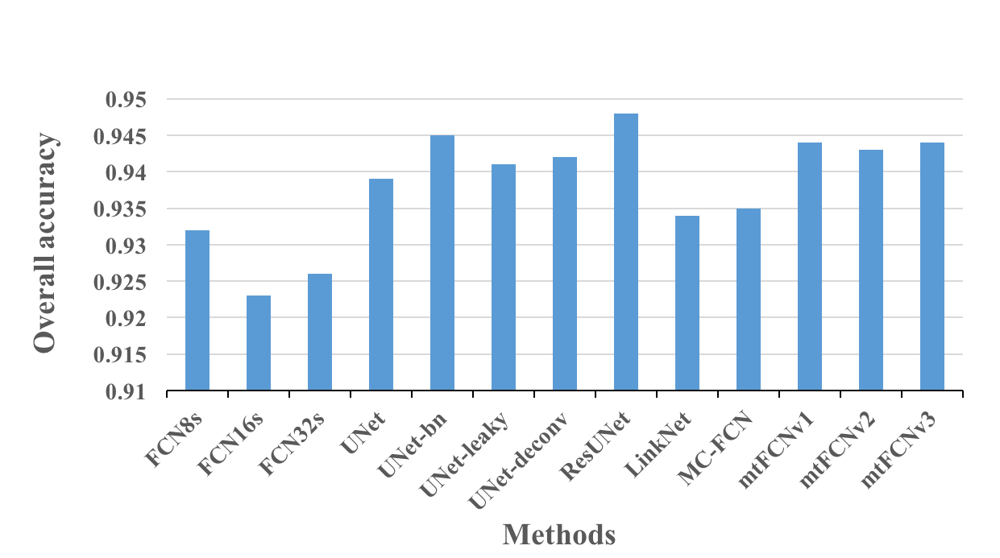
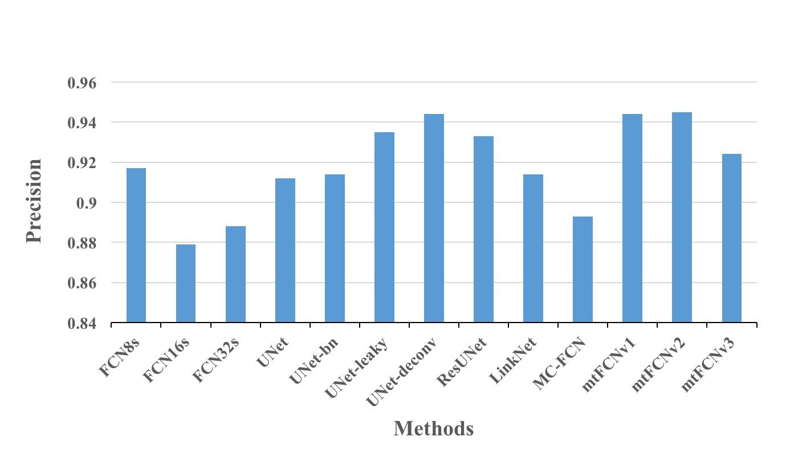
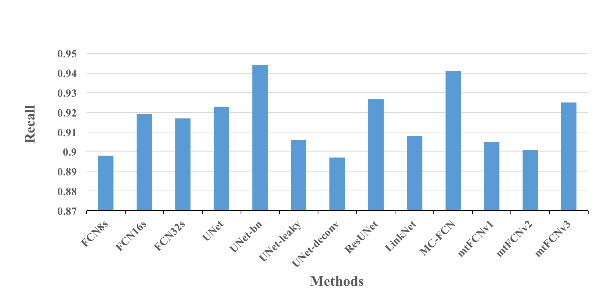
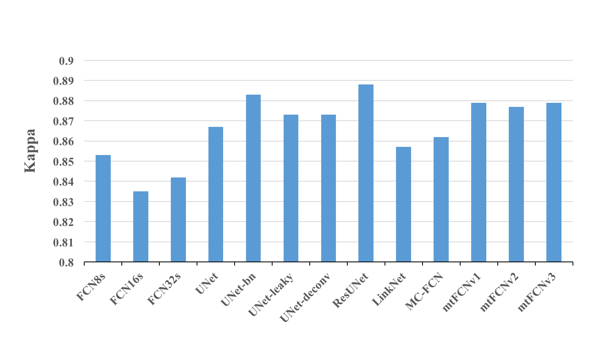
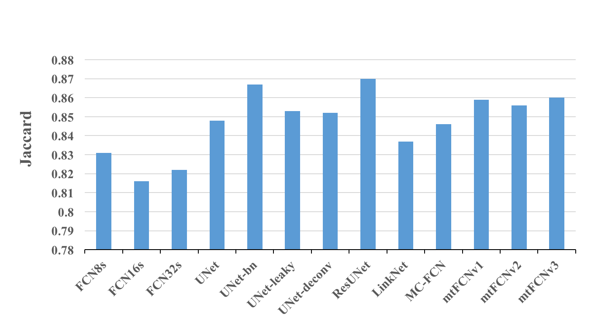
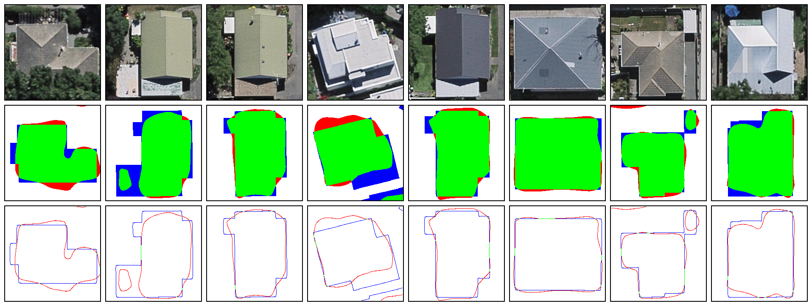

# Geoseg - An Package for Automatic Building Segmentation and Outline extraction via  Deep Learning

## Structure of directories
### Directory for dataset
```
├── dataset
│   └── NewZealand
│       ├── land
│       └── segmap

```
### Directory for saving logs
```
├── logs
│   ├── learning-curve
│   ├── statistic
│   └── training
```
### Directory for model files
```
├── models
│   ├── __init__.py
│   ├── blockunits.py
│   ├── fcn.py
│   ├── fpn.py
│   ├── lenet.py
│   ├── linknet.py
│   ├── mcfcn.py
│   ├── mtfcn.py
│   ├── resunet.py
│   └── unet.py
```
### Directory for result
```
├── result
│   ├── comparison
│   ├── excel
│   └── single
```
### Directory for utils
```
├── utils
│   ├── __init__.py
│   ├── datasets.py
│   ├── metrics.py
│   ├── preprocess.py
│   ├── runner.py
│   └── vision.py
```
### Files used for training & evaluating model
```
├── GAN.py
├── PatchGAN.py
├── cGAN.py
├── FCNs.py
├── FPN.py
├── UNet.py
├── mtFCN.py
├── LinkNet.py
├── MC-FCN.py
├── ResUNet.py
...
```
### Files for generate visualization
```
├── genArea.py
├── genComparison.py
├── genSingle.py
...
```

## Model Performance

### Accuracy Performance
* Overall-accuracy

* Precision

* Recall

* Kappa

* Jaccard


### Computational Performance
* Time cost

* FPS


## Visualization Samples

### Learning Curve
* FCN8s


### Segmentation and ouline extraction
* FCN8s


### Segmentation result comparison
* FCN8s, FCN16s, FCN32s


### Edge extraction result comparison
* FCN8s, FCN16s, FCN32s

