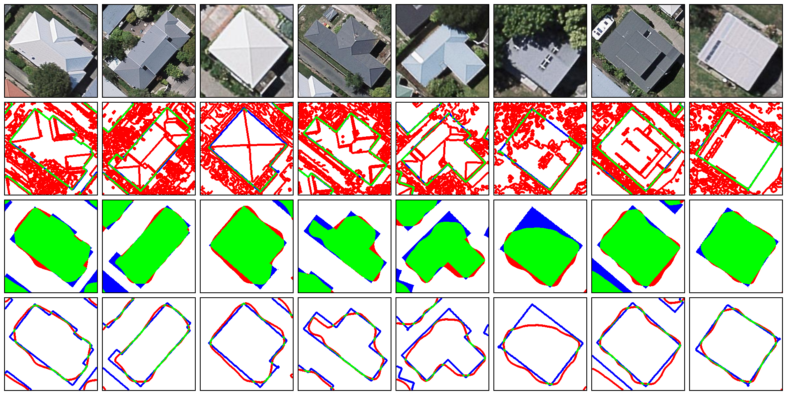
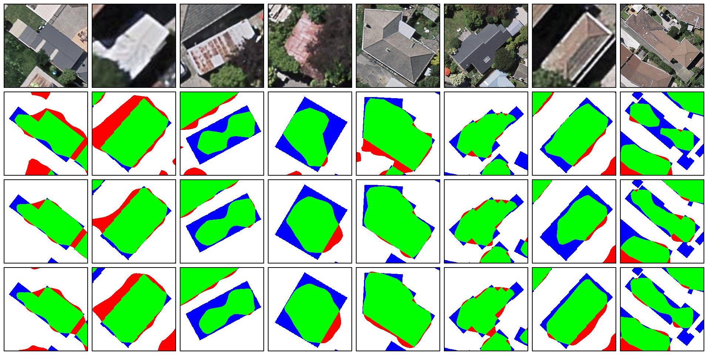
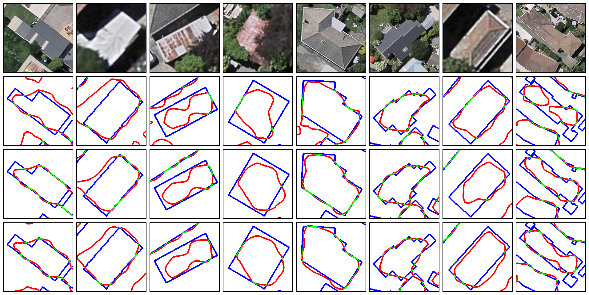

# Geoseg - An Package for Automatic Building Segmentation and Outline extraction via  Deep Learning

## Structure of directories
### sub directories
```
├── dataset/
│   └── NewZealand
├── logs/
│   ├── learning curve, loging, statistic etc.
├── models/
│   ├── fcn, fpn, u-nt, segnet, etc.
├── result/
│   ├── comparison
│   ├── excel
│   └── single
├── utils/
│   ├── datasets.py
│   ├── metrics.py
│   ├── preprocess.py
│   ├── runner.py
│   └── vision.py
```
### Files used for training model
```
├── FCNs.py
├── FPN.py
├── UNet.py
├── MC-FCN.py
├── BR-Net.py
├── ResUNet.py
...
```
### Files for generate visualization
```
├── visSingle.py
├── visSingleComparison.py
...
```

## Model Performance

### Accuracy Performance
* Overall-accuracy

* Precision

* Recall

* Kappa

* Jaccard


### Computational Performance
* Time cost

* FPS


## Visualization Samples

### Learning Curve
* FCN8s


### Segmentation and outline extraction
* FCN8s


### Segmentation result comparison
* FCN32s, FCN16s, FCN8s


### Edge extraction result comparison
* FCN32s, FCN16s, FCN8s

